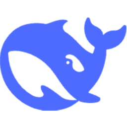
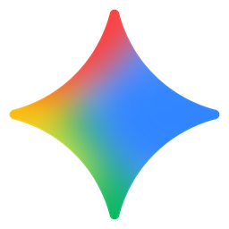
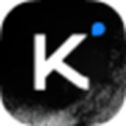
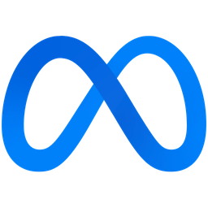
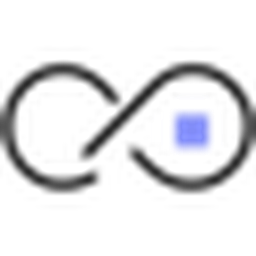
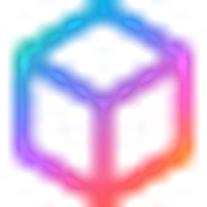
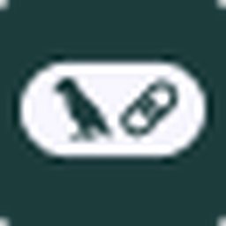

# 🧭 Awesome AI Apps Catalog

> AI apps directory / AI 应用导航：聊天、图片、视频、翻译、代码、语音、办公、搜索、智能体。点击图标直达官网。数据源：`data/projects.yaml`，图标自动抓取到 `assets/icons/`。

## 聊天 / 助手

| <a href='https://openai.com/chatgpt' target='_blank' rel='noopener noreferrer'>🔗&nbsp;ChatGPT</a> OpenAI | <a href='https://www.anthropic.com/claude' target='_blank' rel='noopener noreferrer'>&nbsp;Claude</a> Anthropic | <a href='https://www.deepseek.com/' target='_blank' rel='noopener noreferrer'>&nbsp;DeepSeek</a> Reasoning |
| :-- | :-- | :-- |
| <a href='https://www.perplexity.ai/' target='_blank' rel='noopener noreferrer'>&nbsp;Perplexity</a> Answer engine | <a href='https://gemini.google.com/app' target='_blank' rel='noopener noreferrer'>&nbsp;Google Gemini</a> Google | <a href='https://copilot.microsoft.com/' target='_blank' rel='noopener noreferrer'>&nbsp;Microsoft Copilot</a> Microsoft |
| :-- | :-- | :-- |
| <a href='https://kimi.moonshot.cn/' target='_blank' rel='noopener noreferrer'>&nbsp;Kimi</a> Moonshot AI | — | — |
| :-- | :-- | :-- |

## 图片生成 / 图像

| <a href='https://openai.com/dall-e-3' target='_blank' rel='noopener noreferrer'>🔗&nbsp;DALL·E</a> OpenAI | <a href='https://stability.ai/' target='_blank' rel='noopener noreferrer'>&nbsp;Stable Diffusion</a> Stability AI | <a href='https://www.midjourney.com/' target='_blank' rel='noopener noreferrer'>🔗&nbsp;Midjourney</a> 社区/Bot |
| :-- | :-- | :-- |
| <a href='https://black-forest-labs.com/' target='_blank' rel='noopener noreferrer'>🔗&nbsp;Flux</a> BFL | <a href='https://playground.com/' target='_blank' rel='noopener noreferrer'>&nbsp;Playground</a> Playground v2 | <a href='https://ideogram.ai/' target='_blank' rel='noopener noreferrer'>🔗&nbsp;Ideogram</a> 排版/字效 |
| :-- | :-- | :-- |

## 翻译 / 语言

| <a href='https://translate.google.com/' target='_blank' rel='noopener noreferrer'>&nbsp;Google Translate</a> 谷歌翻译 | <a href='https://www.deepl.com/translator' target='_blank' rel='noopener noreferrer'>&nbsp;DeepL</a> DeepL 翻译 | <a href='https://platform.openai.com/usage' target='_blank' rel='noopener noreferrer'>🔗&nbsp;OpenAI Translate</a> API 中的翻译能力 |
| :-- | :-- | :-- |
| <a href='https://ai.meta.com/research/no-language-left-behind/' target='_blank' rel='noopener noreferrer'>&nbsp;NLLB (Demo)</a> Meta 研究 | <a href='https://aimangatranslate.com/' target='_blank' rel='noopener noreferrer'>&nbsp;manga translator</a> Planva | — |
| :-- | :-- | :-- |

## 视频 / 影视生成

| <a href='https://runwayml.com/' target='_blank' rel='noopener noreferrer'>&nbsp;Runway Gen-3</a> Runway | <a href='https://pika.art/' target='_blank' rel='noopener noreferrer'>&nbsp;Pika</a> 视频生成 | <a href='https://lumalabs.ai/dream-machine' target='_blank' rel='noopener noreferrer'>&nbsp;Luma Dream Machine</a> Luma AI |
| :-- | :-- | :-- |
| <a href='https://klingai.com/' target='_blank' rel='noopener noreferrer'>&nbsp;Kling AI</a> 快手 | <a href='https://stability.ai/stable-video' target='_blank' rel='noopener noreferrer'>&nbsp;Stable Video Diffusion</a> Stability AI | <a href='https://openai.com/sora' target='_blank' rel='noopener noreferrer'>🔗&nbsp;Sora (preview)</a> 研究预览 |
| :-- | :-- | :-- |

## 代码助手 / 开发

| <a href='https://github.com/features/copilot' target='_blank' rel='noopener noreferrer'>&nbsp;GitHub Copilot</a> GitHub | <a href='https://aws.amazon.com/codewhisperer/' target='_blank' rel='noopener noreferrer'>&nbsp;CodeWhisperer</a> AWS | <a href='https://cursor.com/' target='_blank' rel='noopener noreferrer'>&nbsp;Cursor</a> AI IDE |
| :-- | :-- | :-- |
| <a href='https://codeium.com/windsurf' target='_blank' rel='noopener noreferrer'>&nbsp;Windsurf</a> Codeium IDE | <a href='https://codeium.com/' target='_blank' rel='noopener noreferrer'>&nbsp;Codeium</a> 代码补全 | <a href='https://replit.com/ai' target='_blank' rel='noopener noreferrer'>&nbsp;Replit AI</a> Replit |
| :-- | :-- | :-- |

## 语音 / 音频 / 音乐

| <a href='https://elevenlabs.io/' target='_blank' rel='noopener noreferrer'>&nbsp;ElevenLabs</a> TTS/配音 | <a href='https://platform.openai.com/docs/guides/text-to-speech' target='_blank' rel='noopener noreferrer'>🔗&nbsp;OpenAI TTS</a> 多语音合成 | <a href='https://suno.com/' target='_blank' rel='noopener noreferrer'>&nbsp;Suno</a> AI 音乐 |
| :-- | :-- | :-- |
| <a href='https://www.udio.com/' target='_blank' rel='noopener noreferrer'>&nbsp;Udio</a> AI 音乐 | <a href='https://ai.meta.com/blog/voicebox/' target='_blank' rel='noopener noreferrer'>🔗&nbsp;Voicebox (Meta</a> 研究 | — |
| :-- | :-- | :-- |

## 办公 / 文档 / 生产力

| <a href='https://www.notion.so/product/ai' target='_blank' rel='noopener noreferrer'>&nbsp;Notion AI</a> 笔记/文档 | <a href='https://workspace.google.com/intl/zh-cn/products/gemini/' target='_blank' rel='noopener noreferrer'>&nbsp;Google Workspace Duet/Gemini</a> Docs/Sheets/Slides | <a href='https://www.microsoft.com/en-us/microsoft-365/copilot' target='_blank' rel='noopener noreferrer'>&nbsp;Microsoft Copilot for 365</a> Word/Excel/PPT |
| :-- | :-- | :-- |
| <a href='https://www.canva.com/magic/' target='_blank' rel='noopener noreferrer'>&nbsp;Canva Magic</a> 设计 | <a href='https://www.slidesai.io/' target='_blank' rel='noopener noreferrer'>&nbsp;SlidesAI</a> PPT 生成 | — |
| :-- | :-- | :-- |

## 搜索 / 资料助理

| <a href='https://www.perplexity.ai/' target='_blank' rel='noopener noreferrer'>&nbsp;Perplexity</a> Answer engine | <a href='https://you.com/' target='_blank' rel='noopener noreferrer'>&nbsp;You.com</a> AI 搜索 | <a href='https://www.phind.com/' target='_blank' rel='noopener noreferrer'>🔗&nbsp;Phind</a> 开发者搜索 |
| :-- | :-- | :-- |
| <a href='https://kagi.com/' target='_blank' rel='noopener noreferrer'>&nbsp;Kagi</a> 订阅搜索 | — | — |
| :-- | :-- | :-- |

## 智能体 / 自动化

| <a href='https://python.langchain.com/docs/modules/agents/' target='_blank' rel='noopener noreferrer'>&nbsp;LangChain Agents (docs)</a> 框架 | <a href='https://microsoft.github.io/autogen/' target='_blank' rel='noopener noreferrer'>🔗&nbsp;AutoGen (Microsoft)</a> 多智能体 | <a href='https://www.crewai.com/' target='_blank' rel='noopener noreferrer'>&nbsp;CrewAI</a> 多智能体编排 |
| :-- | :-- | :-- |
| <a href='https://opendevin.github.io/' target='_blank' rel='noopener noreferrer'>🔗&nbsp;OpenDevin</a> 自动化开发 | — | — |
| :-- | :-- | :-- |
